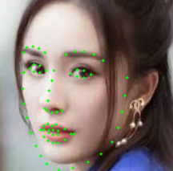

# 26M Flops Facial Landmark Detection
This is a PyTorch Implementation of https://github.com/610265158/face_landmark which is built with Tensorflow. Thanks very much for his pioneer contribution and impressing results. Also respect towards PFLD https://arxiv.org/pdf/1902.10859.pdf. 

Here is a Demo with 23M file size :D. 女神迪丽热巴。


Other Chinese famous actors:




这个库是610265158的face_landmark库的PyTorch实现，用户名是他的QQ号，赶紧去面基。

## Introduction
The training and inference strategies are just copy of 610265158. WingLoss, Multi-layer feature concatenation, Headpose/Face classification assisted training are all used. The differences with 610265158 are:
 1. I trained the model with the Slim network. The computation cost with 160 input is **26.5M Flops**. 
 2. I trained the model with 300W-LP dataset. 
 3. I added LK optical flow smoothing at inference stage. 
 4. ONNX, MNN are included. 

训练和推理处理基本是抄上面那个人的。该用的策略都用了。不同点主要是用更轻量的Slim网络和用300W-LP训练模型。Slim网络的结构特别适合通过MNN在移动端上使用。光流跟踪主要是提升视觉稳定性。另外，工程提供了一个简易的人脸检测器来Demo效果，直接把 https://github.com/Linzaer/Ultra-Light-Fast-Generic-Face-Detector-1MB 这个库里的模型包装了一下就拿来用了。你们可以换成自己的。

#### Environment
 1. The code is tested on Windows 10. Linux should also be OK. Inference code should work on Mac OS, but Training... 兄弟别想不开。
 2. PyTorch 1.2.0.
 3. OpenCV 4.1.2.30. 

其它版本应该都问题不大，如果有问题，自行翻墙解决。

## Train
Modify data_dir variable in make_json.py, and run it. It will generate train.json and val.json. 
The data_dir should be organized as:

```
├── 300VW
│   ├── 001_annot
│   ├── 002_annot
│       ....
├── 300W
│   ├── 01_Indoor
│   └── 02_Outdoor
├── AFW
│   └── afw
├── HELEN
│   ├── testset
│   └── trainset
├── IBUG
│   └── ibug
├── LFPW
│   ├── testset
│   └── trainset
```

Yes, the code above is also copied from 610265158. 

Then run `python train.py`. 

In my experience, the training is extremely slow, especially with the exploding balanced training sets. You can run `recon_dataset.py` before run `python train.py` to accelerate the training by reduce the size of the images. 

这个`recon_dataset.py`的原理就是把图片裁一下，这样训练的时候读数据的时候能快一些。

I trained with about 4 hours per epoch on my RTX2060. Sad...

## Demo
Run `demo.py`. Change the code as you need. 

## Others
谁如果训练出了效果更好的模型请分享一下，还有其它问题的话我们Issue见。
